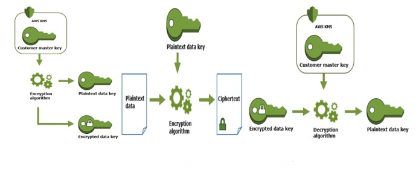

## aws-saa-security

---

## AWS Security and Encryption
---

### Encryption in Flight (SSL)
- What - When sensitive data(password, cretit card information, secured financial transactional data etc.) travels over the internet, encryption-in-flight helps to protect it from being hijacked. no one along the way should be able to view/tamper it.
- Why - Protects against Man in the Middle attacks
- How - Data is encrypted before sending and decrypted after download with the help of SSL certificate

---

### Encryption at Rest - Server Side Encryption
- What - Data is encrypted after being received by Server with the help of a key
- Why - Protects the data even if someone gets access to server
- How - Data is encrypted after being received and decrypted before being sent with the help of a key. The keys are managed at a place and accessible to the server.

---

### Encryption at Rest - Client Side Encryption
- What - Data is encrypted by the client and never decrypted by Server
- Why - Protects the data even if someone gets access to server
- How - Data is encrypted after being received and decrypted before being sent with the help of a key. The keys are managed at a place and accessible to the server.

---

---
## AWS KMS
- What - 
  - AWS Managed Service
  - Fully integrated with IAM for authorization. 
  - Seamlessly integrated with most of the AWS Services:
    - S3
    - EBS
    - RDS
    - SSM - Parameter Store
---

  - Types:
    - Symmetric 
      - Single Encryption key that is used for both encryption and decryption
      - Users never get access to the unencrypted Key
      - Three types of CMKs:
        - AWS Managed Service Default CMK
        - User Created - $1 per month
        - User Keys Imported - $1 per month
    - 
    - Assymetric - 
      - Two keys
      - Public Key is for encryption
      - Private Key is for Decryption
- 
---

- AWS Systems Manager (SSM)
  A central place to view and manage AWS Resources
  - Parameter Store
- AWS Secrets Manager
- WAF & Shield
  - Shield - layer 3, layer 4
  - WAF - layer 7
- https://docs.aws.amazon.com/waf/latest/developerguide/waf-which-to-choose.html
- 
  
---

 
